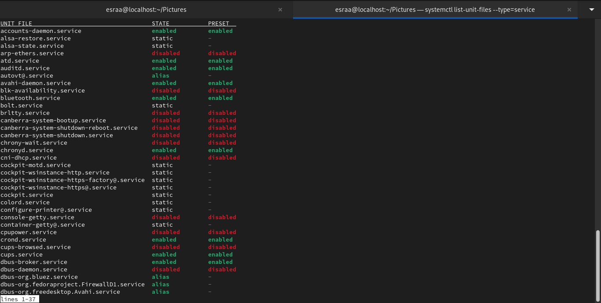

lab1

### 2. What is the difference between cat and more command?
####   Both display rhe content of the file but the difference is that in case of larger files, 'cat' command output will scroll off your screen while 'more' command displays output one screenful at a time (page by page ).
    

### 3. What is the difference between rm and rmdir using man?
#### rm 
##### Remove files or directories

##### SYNOPSIS rm [OPTION]... [FILE]...
#### DESCRIPTION
#####  This manual page documents the GNU version of rm. rm removes each specified file. By default, it does not remove directories.    
#### rmdir
##### Remove empty directories
##### SYNOPSIS rmdir [OPTION]... DIRECTORY...
#### DESCRIPTION    
##### Remove the DIRECTORY(ies), if they are empty.

### 4. Create the following hierarchy under your home directory:

#### a. Remove dir11 in one-step. What did you notice? And how did you overcome that?

#### b. Then remove dir12 using rmdir –p command. State what happened to the

#### c. The output of the command pwd was /home/user. Write the absolute and relative path for the file mycv

### 5. Copy the /etc/passwd file to your home directory making its name is mypasswd.
### 6. Rename this new file to be oldpasswd.

### 7. You are in /usr/bin, list four ways to go to your home directory

### 8. List Linux commands in /usr/bin that start with letter w

### 9. Display the first 4 lines of /etc/passwd

### 10.Display the last 7 lines of /etc/passwd

### 11.Display the man pages of passwd the command and the file sequentially in one command.

### 12.Display the man page of the passwd file.

### 13.Display a list of all the commands that contain the keyword passwd in their man page.

## Lab2
### 1. Create a user account with the following attribute and username: islam and Fullname/comment: Islam Askar and Password: islam

### 2. Create a user account with the following attribute and Username: baduser and Full name/comment: Bad User and Password: baduser

### 3. Create a supplementary (Secondary) group called pgroup with group ID of 30000

### 4. Create a supplementary group called badgroup

### 5. Add islam user to the pgroup group as a supplementary group

### 6. Modify the password of islam's account to password

### 7. Modify islam's account so the password expires after 30 days

### 8. Lock bad user account so he can't log in

### 9. Delete bad user account

### 10. Delete the supplementary group called badgroup.

### 13.Create a folder called myteam in your home directory and change its permissions to read only for the owner.

### 14.Log out and log in by another user.

### 15.Try to access (by cd command) the folder (myteam)

### 17.What are the minimum permission needed for:
#### Copy a directory (permission for source directory and permissions for target parent directory)
##### source directory : r-x
##### target parent directory: -wx
#### Copy a file (permission for source file and and permission for target parent directory)
##### file: r--
##### source directory : --x
##### target parent directory : -wx
#### Delete a file
##### file: ---
##### source directory: -wx
#### Change to a directory
##### --x
#### List a directory content (ls command)
##### r--
#### View a file content (more/cat command)
##### r--
#### Modify a file content
##### for interactive tool like vi need rw-
##### for non interative tool vi need -w-

## Lab 3
### 1. Using vi write your CV in the file mycv. Your CV should include your name, age, school,college, experience,...

### 2. Open mycv file using vi command then: Without using arrows state how to:
#### a. using j key
#### b. using k key
#### c. using /age
#### d. :5
#### e.using D
#### f.using $
### 3. List the available shells in your system.

### 4. List the environment variables in your current shell.

### 5. List all of the environment variables for the bash shell.

### 6. What are the commands that list the value of a specific variable?

### 7. Display your current shell name.
   

### 11. Create a Bash shell alias named ls for the “ls –l” command

## Lab 4

### 1. List the user commands and redirect the output to /tmp/commands.list

### 2. Count the number of user commands
     

### 3. Get all the users names whose first character in their login is ‘g’.
   

### 4. Get the logins name and full names (comment) of logins starts with “g”.

### 5. Save the output of the last command sorted by their full names in a file.

### 6. Write two commands: first: to search for all files on the system that named .bash_profile. Second: sorts the output of ls command on / recursively, Saving their output and error in 2 different files and sending them to the background.

### 7. Display the number of users who is logged now to the system.

### 8.Display lines 7 to line 10 of /etc/passwd file

### 9. What happens if you execute:

#### a. cat filename1 | cat filename2

#### b. Tcat filename1 | cat filename2

#### c. ls /etc/passwd | wc –l

### 10.Issue the command sleep 100.
### 11.Stop the last command.
### 12.Resume the last command in the background
### 13.Issue the jobs command and see its output.
### 14.Send the sleep command to the foreground and send it again to the background.
### 15.Kill the sleep command.

### 16.Display your processes only

### 17.Display all processes except yours

### 18.Use the pgrep command to list your processes only

### 19.Kill your processes only.

## lab5
#### 1. Compress a file by compress, gzip, zip commands and decompress it again. State the differences between compress and gzip commands.

#### 2. What is the command used to view the content of a compressed file.

#### 3. Backup /etc directory using tar utility.

#### 4. Starting from your home directory, find all files that were modified in the last two day.

#### 5. Starting from /etc, find files owned by root user.

#### 6. Find all directories in your home directory.

#### 7. Write a command to search for all files on the system that, its name is “.profile”.

#### 8. Identify the file types of the following: /etc/passwd, /dev/pts/0, /etc, /dev/sda

#### 9. List the inode numbers of /, /etc, /etc/hosts.

#### 10. Copy /etc/passwd to your home directory, use the commands diff and cmp, and Edit in the
file you copied, and then use these commands again, and check the output.

#### 11. Create a symbolic link of /etc/passwd in /boot.
 

#### 12. Create a hard link of /etc/passwd in /boot. Could you? Why
##### 

###### creating a hard link between files on different file systems is not allowed. Hard links are restricted to the same file system because they share the same inode, and inodes are specific to a file system

## Lab6
###
### 1.Use systemctl to view the status of all the system services.

### 2.Change the default run level back to multi-user.target and reboot.

### 3.Send mail to the root user.

### 4.Verify that you have received this mail.

### 5.Use  systemctl utility to stop postfix service

### 6.Send mail again to the root user.

### 7.Verify that you have received this mail.

### 8.Use systemctl utility to start postfix service

### 9.Verify that you have received this mail.

